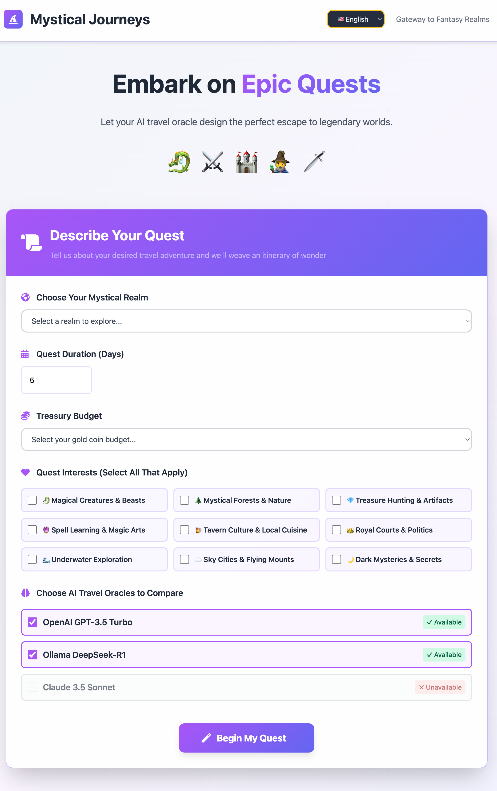

# 🧙‍♂️ Mystical Journeys - Fantasy Travel Agency

An AI-powered fantasy travel planning application built with FastAPI and Python, featuring multi-provider AI integration with real-time streaming responses. Journey through enchanted realms and mystical destinations with our AI travel oracles crafting personalized quest itineraries.

<div align="center">
  
</div>

## 🎯 Origin Story

I built a thing! Last night I hacked together this site with Claude to experiment with setting up an example that pulled from a couple LLM APIs. The main goal was to experiment and learn. Note Ollama is setup to integrate from a local running LLM application while the rest pull from APIs. I pulled in Ollama (and this can be true for other LLMs you run on your laptop) to show this can be run without having to pay to use the APIs from other LLMs. Check it out and try it out.

This project demonstrates multi-LLM integration patterns and real-time streaming architectures, showcasing how to:

**Key Implementation Files to Check Out:**
- `app/main.py` - FastAPI routes and streaming logic
- `app/providers.py` - LLM provider abstractions and implementations
- `app/config.py` - Configuration and prompt engineering
- `static/app.js` - Frontend streaming event handling

## ✨ What This Demonstrates

### 🏗️ **Technical Patterns**
- **Multi-LLM Integration**: OpenAI, Anthropic Claude, and local Ollama in one app
- **Real-time Streaming**: Server-Sent Events for live response generation
- **Concurrent API Calls**: Parallel provider requests with graceful fallbacks
- **Local + Cloud Hybrid**: Run free local models alongside paid APIs

### 🎨 **User Experience Features**
- **🤖 Provider Comparison**: Side-by-side itineraries from different AI models
- **⚡ Live Generation**: Watch travel plans appear in real-time
- **🎭 Fantasy Theme**: Creative interface without traditional chat UI
- **🌍 Smart Planning**: Budget-aware, interest-based recommendations
- **📱 Responsive Design**: Works on desktop and mobile
- **🐉 Dragon Language**: Toggle between English and emoji translations

<div align="center">
  
</div>

## 🚀 Quick Start

### Prerequisites
- Python 3.8+ 
- OpenAI API key ([Get one here](https://platform.openai.com/api-keys))

### Installation

1. **Clone the repository**:
   ```bash
   git clone https://github.com/yourusername/mystical_journeys.git
   cd mystical_journeys
   ```

2. **Set up the environment**:
   ```bash
   ./run.sh
   ```

3. **Configure your API key**:
   ```bash
   echo "OPENAI_API_KEY=your_actual_key_here" > .env
   ```

4. **Launch the application**: 
   Open `http://localhost:8000` in your browser

### Manual Setup (Alternative)
```bash
python -m venv .venv
source .venv/bin/activate  # Windows: .venv\Scripts\activate
pip install -r requirements.txt
echo "OPENAI_API_KEY=your_key" > .env
python -m uvicorn app.main:app --reload --host 0.0.0.0 --port 8000
```

## 🏗️ Architecture

### Tech Stack
- **Backend**: FastAPI with Python 3.8+
- **Frontend**: Vanilla JavaScript, HTML5, CSS3
- **AI Integration**: OpenAI, Anthropic, Ollama APIs
- **Styling**: Tailwind CSS via CDN
- **Server**: Uvicorn ASGI server

### Project Structure
```
├── app/
│   ├── main.py           # FastAPI application & routes
│   ├── models.py         # Pydantic data models
│   ├── providers.py      # LLM provider implementations  
│   └── config.py         # App configuration & prompts
├── templates/
│   └── index.html        # Main application interface
├── static/
│   ├── app.js            # Frontend JavaScript logic
│   └── style.css         # Custom styles & animations
├── tests/                # Comprehensive test suite
├── run.sh                # Development server script
├── run_tests.sh          # Test suite script
└── requirements.txt      # Python dependencies
```

## ⚙️ Configuration

### Required Environment Variables
```env
# Minimum setup - just OpenAI
OPENAI_API_KEY=your_openai_api_key_here
```

### Optional Providers
```env
# Add Claude 3.5 Sonnet comparison
ANTHROPIC_API_KEY=your_anthropic_key_here

# Add local Ollama (install ollama.ai first)
OLLAMA_BASE_URL=http://localhost:11434
OLLAMA_MODEL=deepseek-r1:8b
```

### Provider Setup
- **OpenAI** (Required): Get key from [platform.openai.com](https://platform.openai.com/api-keys)
- **Anthropic** (Optional): Get key from [console.anthropic.com](https://console.anthropic.com/)
- **Ollama** (Optional): Install from [ollama.ai](https://ollama.ai/), then `ollama pull deepseek-r1:8b`

## 🧪 Testing

Run the comprehensive test suite:
```bash
# Run all tests
./run_tests.sh

# Or run specific test categories
pytest tests/test_main.py -v      # API endpoints
pytest tests/test_models.py -v    # Data models  
pytest tests/test_frontend.py -v  # Frontend elements
```

## 📚 API Reference

### `GET /`
Serves the main application interface with fantasy-themed travel planning form.

### `POST /generate-comparison`
Generates travel itinerary comparison using selected AI providers.

**Request Body:**
```json
{
  "destination": "Enchanted Forest of Eldara",
  "days": 7,
  "budget": "moderate",
  "interests": ["magical_creatures", "mystical_forests"],
  "providers": ["openai", "claude"]
}
```

**Response:** Server-Sent Events stream with real-time itinerary generation

### `POST /generate-booking-response`
Generates a whimsical confirmation message from the selected AI provider.

### `GET /providers`
Returns available AI providers and their current status.

## 🚀 Production Deployment

### Simple Production
```bash
python -m uvicorn app.main:app --host 0.0.0.0 --port 8000 --workers 4
```

### With Process Manager
```bash
pm2 start "python -m uvicorn app.main:app --host 0.0.0.0 --port 8000" --name mystical-journeys
```

## 🔧 Technical Implementation

### Streaming Architecture
- **Server-Sent Events (SSE)** for real-time response streaming
- **Concurrent provider calls** using asyncio for parallel AI requests
- **Graceful error handling** with individual provider fallbacks

### AI Provider Integration
- **OpenAI GPT-3.5** - Primary cloud provider for reliable responses
- **Anthropic Claude 3.5 Sonnet** - Alternative cloud provider for comparison
- **Ollama (DeepSeek-R1)** - Local LLM for cost-effective and private inference

### Frontend Features
- **Vanilla JavaScript** with async/await patterns for clean code
- **Tailwind CSS** for rapid UI development
- **Responsive design** optimized for mobile and desktop
- **Fantasy theming** with dragon language toggle for unique UX

## 🐛 Known Issues & Improvements

- **DeepSeek Output Formatting**: The `deepseek-r1` model occasionally includes conversational commentary despite prompt engineering. Future improvements could include output parsing or model fine-tuning for consistent formatting.

## 🤝 Contributing

1. Fork the repository
2. Create a feature branch (`git checkout -b feature/amazing-feature`)
3. Commit your changes (`git commit -m 'Add amazing feature'`)
4. Push to the branch (`git push origin feature/amazing-feature`)
5. Open a Pull Request

## 📄 License

This project is open source and available under the [MIT License](LICENSE).

## 🙏 Acknowledgments

- Built with assistance from Anthropic Claude for rapid prototyping
- Inspired by the need for multi-LLM integration patterns
- Fantasy theme chosen to make AI interaction more engaging and memorable